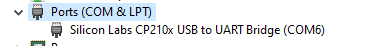
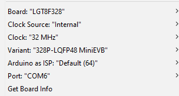
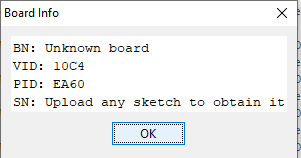

## Handling the LGT8F328P ProMini clone (MiniEVB)

Use same package of LGT8x, which is also included support for MiniEVB

Package URL: https://raw.githubusercontent.com/dbuezas/lgt8fx/master/package_lgt8fx_index.json

Use the USB to UART CP2102 driver

The pins:

MiniEVB	Module CP2102

VCC	VCCIO

GND	GND

RXI	TXD

TX0	RXD

DTR	DTR

Issue when no driver software installed:

Download this driver software

https://www.silabs.com/documents/public/software/CP210x_Windows_Drivers.zip

Update the driver for the item above in Windows Device Manager, then restart the PC.

In Arduino IDE, choose this setting:

We can get the board info:

### Upload issue:

Sometime, the Arduino IDE hang on uploading code, press RST on the board right when IDE start uploading(can hold a bit), this can solve the problem most of the time. This is common issue with ProMini and the clones.