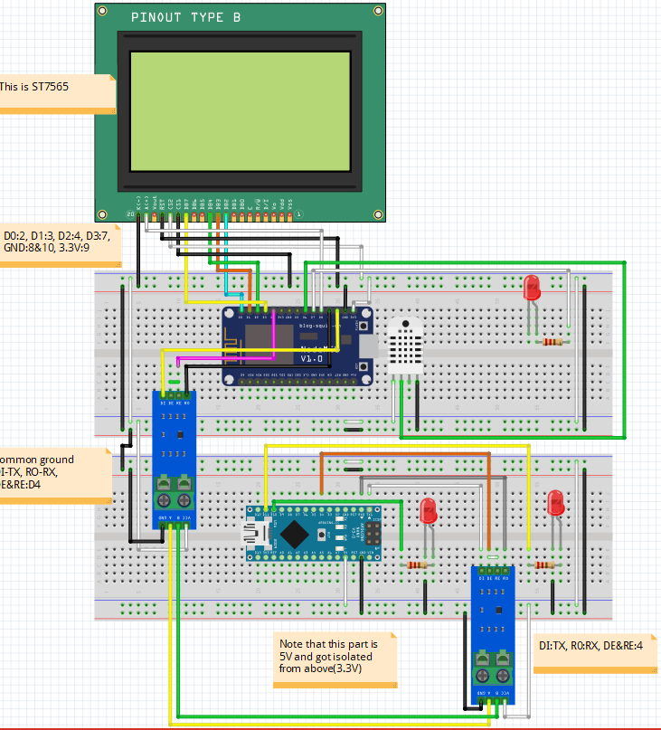
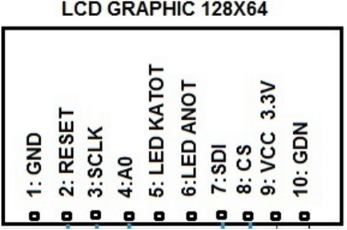

## ESP8266 and LGT8F MODBUS master/slave

A communication in MODBUS RTU with different voltages parts.

### Diagram:

The GLCD ST7565 pin out:

This one is an extension of my previous project of ESP8266 and ST7565

https://github.com/hardwarelayer/arduino_projects/tree/master/esp8266/humid_temp_test

The slave code for LGT8F is using another project here:

https://github.com/hardwarelayer/arduino/tree/master/lgt8_modbus_slave_test2

I made this to prepare for more complex IoT Node test.

### Note:

As LGT8F, ESP8266 will have flash error if TX and RX pin got blocked. So please remember to remove them before doing flashing.