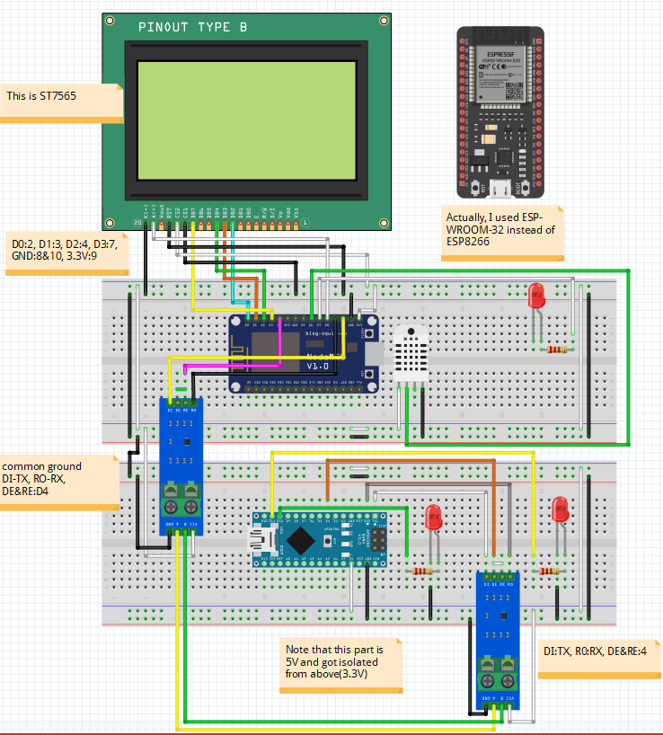

## ESP-WROOM-32 DHT22 & ST7565 As Modbus Master

### Diagram:

The GLCD ST7565 pin out:

### Note: 

About useable pins, I used pins from 17-23 as in this document: https://randomnerdtutorials.com/esp32-pinout-reference-gpios/

This project is based on my previous ESP8266 projects: 
https://github.com/hardwarelayer/arduino_projects/tree/master/esp8266/esp8266_modbus_master
https://github.com/hardwarelayer/arduino_projects/tree/master/esp8266/humid_temp_test

The ST7565 LED's A node use a 100R registor.

I made this to prepare for more complex IoT Node test.