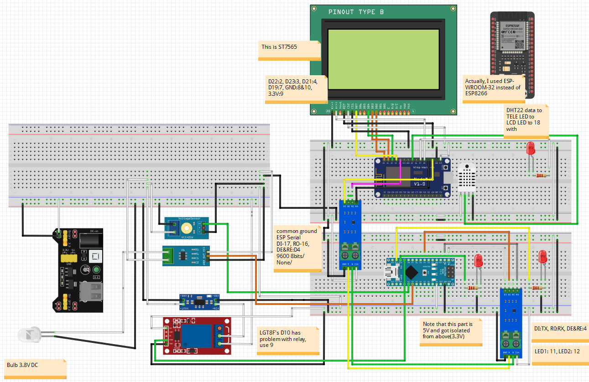

## Hardware skeleton for Azure IoT node project

I use this code to demonstrate all features for a skeleton circuit of Azure IoT.

But this code is for bare demo of the hardware only with MCU / sensors control.

The IoT code is in another project.

#### The ESP32 has 3 different Serial Ports (UART)

Serial0: RX0 on GPIO3, TX0 on GPIO1

Serial1: RX1 on GPIO9, TX1 on GPIO10 (+CTS1 and RTS1)

Serial2: RX2 on GPIO16, TX2 on GPIO17 (+CTS2 and RTS2)

### Diagram:

The GLCD ST7565 pin out:

### Note: 

About useable pins, I used pins from 17-23 as in this document: https://randomnerdtutorials.com/esp32-pinout-reference-gpios/

This project is based on:

My previous ESP-WROOM-32 project:

https://github.com/hardwarelayer/arduino_projects/tree/master/esp_wroom32_dht22_st7565_modbus

My previous ESP8266 projects: 

https://github.com/hardwarelayer/arduino_projects/tree/master/esp8266/esp8266_modbus_master

https://github.com/hardwarelayer/arduino_projects/tree/master/esp8266/humid_temp_test

The ST7565 LED's A node use a 100R registor.

I made this to prepare for more complex IoT Node test.